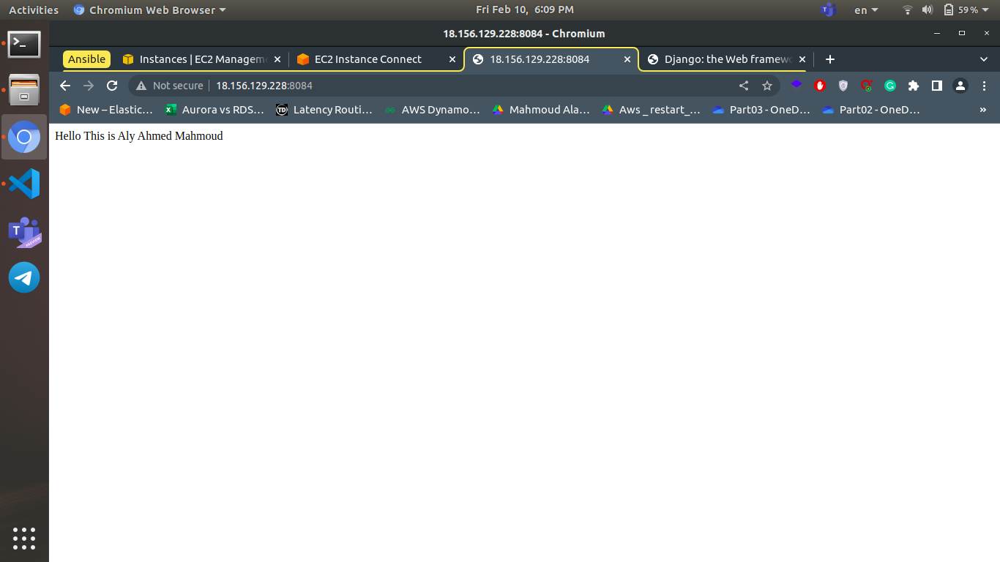
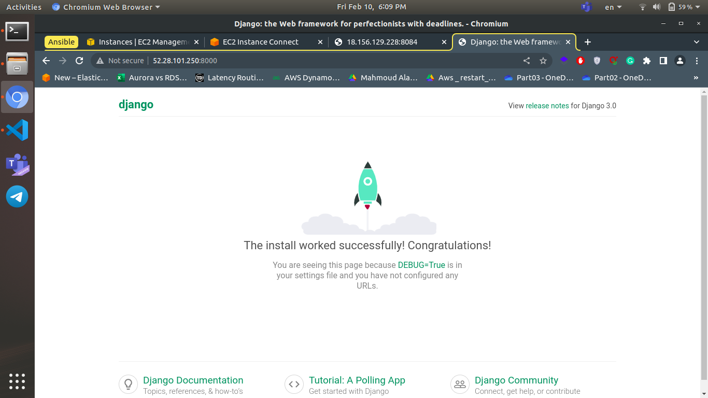

# Ansible Lab1 Hands-on Answers

## Task 1

install NGINX or apache on Machine and Configure it to listen on port 8084 then change the  default page to custom index.html on 2 machines

### how to apply

1- clone this repo

2- edit the ansible_host to your instance public ip and ansible_ssh_private_key_file with your instance private key

3- apply the next command in the terminal


```ansible-playbook playbook.yml -i inventory.txt```

### Output of task 1



## Task 2

Depot your Django app to one of those machines

### how to apply

1- clone this repo

2- edit the ansible_host to your instance public ip and ansible_ssh_private_key_file with your instance private key

3- apply the next command in the terminal

```ansible-playbook Deploy_Django_playbook.yml -i inventory.txt```

### Output of task 2

