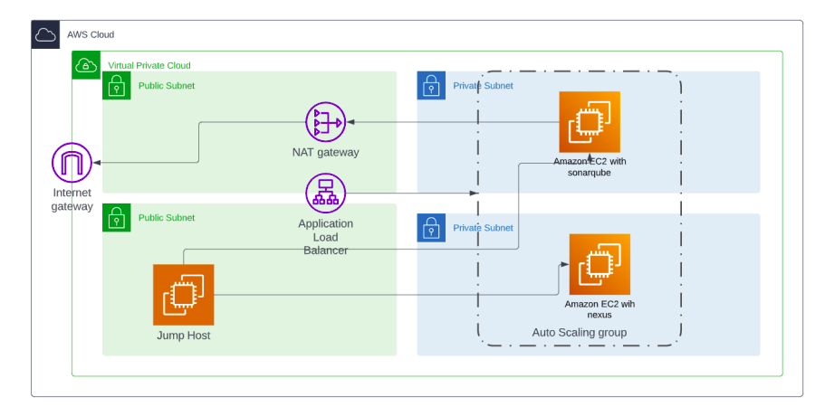

# Ansible Lab 2 (Mini Project) Hands-on Answers

The aim of this Lab is to deal with private instance by a bastion host and use roles in ansible instead of one long playbook for better documentation

## 1- install Nexus in private Machine

- we create Nexus Role that we will customize

    ```ansible-galaxy init Nexus```

- then we customize tasks file like what we have done in this repo

## 2- install SonarQube in private Machine

- we create Postgres Role that we will customize

    ```ansible-galaxy init Postgres```

- then we customize tasks file and vars file like what we have done in this repo

- then we create SonarQube Role that we will customize

    ```ansible-galaxy init SonarQube```

- then we customize tasks file and vars file like what we have done in this repo

## 3- Build our Infra in AWS

we create our infra like this diagram with the differnace of 2 target groups for each private instance

to reach each one by the LoadBalancer using different listener for each target group



## 4- craete our inventory.ini and main Playbook

- just create it as it is created in this repo don't change any thing expect the IP address in ```ansible_host``` for public and private instance
- create the main playbook to install nexus and sonarqube one in each instance
- then edit file **~/.ssh/config** to give ansible the ability to use bastion host to access private instances
  
  ```bash
  Host bastion
        hostname 3.70.204.240
        user ubuntu
        port 22
        identityfile ~/Desktop/Ansible-Tutorial/Lab2/ansible.pem
  ```

## 5- Run the playbook

- by excuting this command
  
    ```ansible-playbook Main_Playbook.yml -i inventory.ini```

## output

we access **Nexus** using LoadBalancer's DNS name like this ```<LoadBalancer_DNS_NAME>:8081``` in browser

the result will be:


we access **SonarQube** using LoadBalancer's DNS name like this ```<LoadBalancer_DNS_NAME>:9000``` in browser

the result will be:


### Note

this is how I created Listeners of used loadbalancer for clarity


